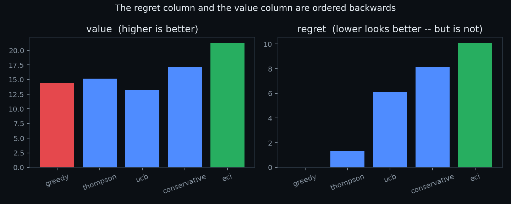
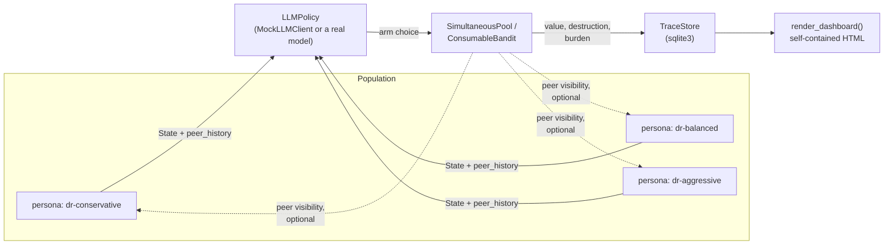
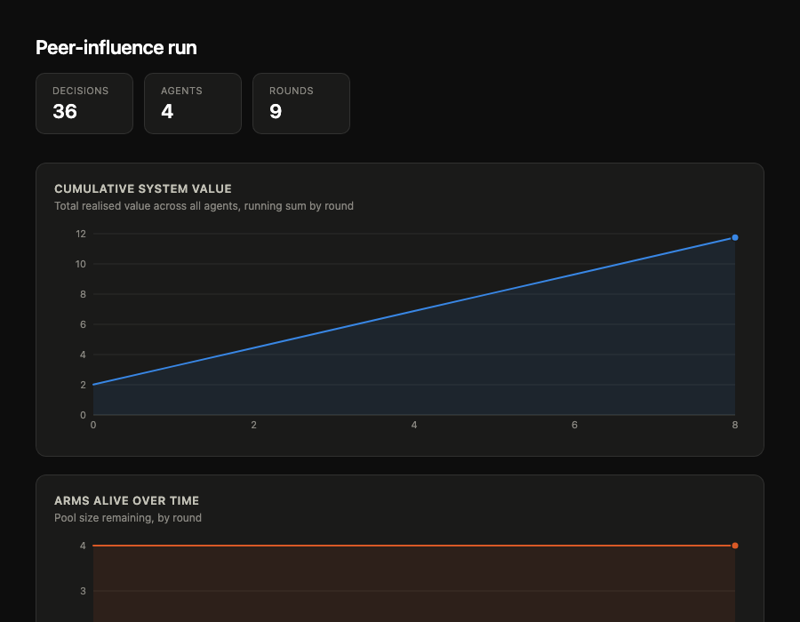
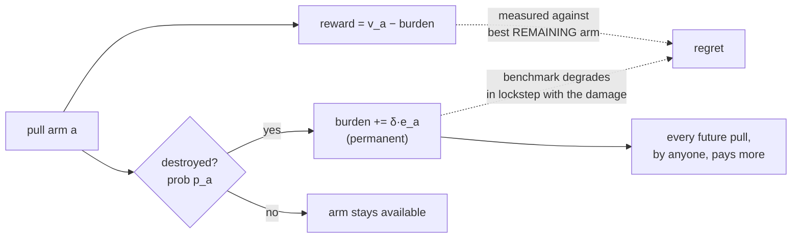

<div align="center">


*Banner artwork, not a real run — every chart elsewhere in this README is
generated from a live simulation; see [Watch it run](#watch-it-run) for the
real ones.*

# ATTRITION
### The simulator for actions that destroy what they touch

**Bandits with Consumable Action Sets**

[](https://github.com/NavikkumarModi/attrition/actions/workflows/tests.yml)
[](tests/)
[](THEORY.md)
[](pyproject.toml)
[](LICENSE)

### **No-regret is not no-harm.**

*A policy can achieve exactly zero regret while destroying unbounded value — and
its own metric will report flawless performance the entire time.*

[Why attrition](#why-attrition) ·
[Watch it run](#watch-it-run) ·
[Quick start](#quick-start) ·
[LLM populations](#llm-agent-populations) ·
[Real data](#grounded-in-real-data) ·
[Theory](#the-model) ·
[Paper](#paper)

</div>

---

Most agent and bandit benchmarks measure whether a policy chose well. None of
them ask what happens when the *choosing itself* uses something up. Every
autonomous agent burning a shared API quota, every prescriber selecting for
antibiotic resistance, every fishery pulling from a stock everyone else also
depends on is playing this game, not the classical one — and its regret
metric will tell it, truthfully, that it's winning the whole time.

attrition is a testbed built around that gap: **actions that permanently
destroy the option they were taken on, with a cost that lands on everyone,
not just the taker.** Eleven results are proven formally, not just observed
empirically. Four scenarios run on real, live data from WHO, openFDA, NOAA,
and CISA/FIRST.org — not synthetic arrays invented to make a point. Agent
populations plug into any real LLM in one function call. And you can watch
the failure happen, live, in a terminal, instead of reading it off a final
printout.

<div align="center">


*A live run of the pharma population layer — four prescriber personas, real
peer visibility, mechanistically-derived resistance dynamics. Generated by
`docs/make_readme_images.py`, not hand-drawn; see [LLM agent populations](#llm-agent-populations).*

</div>

---

## Why attrition

- **Proven, not just simulated.** Eleven theorems, not slogans. Greedy's
  optimality is characterized *exactly* (Theorem 1: iff the marginal
  externality is constant across arms), and the central claim (Theorem 4:
  zero regret, unbounded loss) is a machine-checked construction verified
  15/15 against exact dynamic programming — not a trend that shows up in
  most runs.
- **Grounded in real, live data.** Four scenarios pull real numbers from
  WHO's resistance surveillance, openFDA's recall database, NOAA's
  commercial fishing landings, and CISA/FIRST.org's exploit-probability
  scores — checked in, refreshable with one script, honest about which
  numbers are measured and which are documented modeling proxies.
- **Watch it happen, not just read the number.** `examples/10_live_race.py`
  renders the value gap opening up round by round in your terminal; the
  [live web app](https://attrition-world-simulator.streamlit.app/) turns any
  scenario into an interactive browser dashboard, no install required.
- **Bring your own model.** LLM-driven agent populations plug into Anthropic,
  Groq, or any provider via one function — or run entirely offline against a
  deterministic mock, no API key needed, same code path either way.
- **Own your domain.** Any consumable-choice problem — inventory allocation,
  hiring funnels, credit limits, ad-budget pacing — registers from three
  arrays, no new Python required.

---

## Watch it run

`examples/10_live_race.py` steps Greedy and ECI through the *same* scenario
round by round in a live terminal view, so the value gap isn't a number you
read at the end — it's something you watch open up as each policy's choices
accumulate. Works on any registered scenario, including the real-data ones.

```bash
python examples/10_live_race.py shared-quota --speed 0.06
python examples/10_live_race.py --list        # see every scenario
```

<div align="center">


*The one this framework describes most directly right now: an autonomous
agent — a coding agent, a browser/computer-use agent, anything making tool
calls without a human approving each one — can look flawless on every
individual call while quietly burning a shared API quota or credential pool
every other agent depends on. Postman's 2025 State of the API Report found
unauthorized agent access is developers' top-cited security risk (51%), with
46% specifically worried about agents leaking shared credentials — see
[`attrition/domains.py`](attrition/domains.py)'s `DOMAIN_NOTES["agent_tools"]`
for the full citation and what it was (and wasn't) used for.*


*Real terminal recordings (asciinema → GIF, no hand-editing), regenerated by
`docs/make_casts.sh`. More at
[`docs/images/casts/`](docs/images/casts/) — `adaptive-therapy.gif` (fast,
synthetic) and `antibiotic-stewardship-real.gif` (the WHO-data negative
control, watch the gap stay near zero). Raw `.cast` files are in
[`docs/casts/`](docs/casts/) — much smaller and scrubbable with
`asciinema play docs/casts/<name>.cast`.*

</div>

---

## The one-table version

Five policies, same environments, 25 seeds:

| policy | value | regret | verdict |
|---|---|---|---|
| greedy | 14.449 | **0.000** | perfect metric, worst outcome |
| thompson | 15.171 | 1.341 | |
| ucb | 13.257 | 6.136 | |
| conservative | 17.089 | 8.160 | |
| **eci** | **21.214** | **10.069** | worst metric, best outcome |

The regret column and the value column are ordered **backwards** relative to each
other. Greedy never once fails to pull the best available arm — and ends 47%
below the policy that "looks" worst.



---

## Install

```bash
git clone https://github.com/<user>/attrition
cd attrition
pip install -e .
```

Requires Python 3.9+ and NumPy. Verify the install and reproduce the headline
result in one step:

```bash
python examples/01_quickstart.py
```

Run the full check used in CI (regression tests + all 60 experiments importing
cleanly):

```bash
pip install -e ".[dev]"
pytest tests/ -v
```

## Quick start

```python
from attrition import ConsumableBandit, Greedy, ECI, Conservative, compare

env = lambda seed: ConsumableBandit.random(
    n=20, k_spread=1.5, delta=0.03, horizon=60, seed=seed)

results = compare(env, [Greedy(), Conservative(e_bound=2.0), ECI()], seeds=25)

for name, stats in results.items():
    print(f"{name:>14}  value {stats['value']:7.3f}  regret {stats['regret']:7.3f}")
```

Inspect a single session step by step:

```python
from attrition import run
result = run(env(0), Greedy(), log=True)
for row in result["log"][:10]:
    print(row)          # {'t':.., 'arm':.., 'value':.., 'regret':.., 'alive':..}
```

## Policies

| class | knowledge required | notes |
|---|---|---|
| `Greedy` | `v` | zero regret, unbounded loss |
| `ThompsonSampling`, `UCB` | — | baselines; both consumption-blind |
| `ECI` | `v`, `p`, `e` | externality-corrected index |
| `Conservative` | `v`, `p`, one bound | **recommended default** — no per-arm knowledge |
| `SortByE` | `e` | exactly optimal in pure sequencing |
| `Rollout` | base policy + simulator | 99.5–99.9% of optimum |

---

## LLM agent populations

`attrition.population` runs several LLM-driven policies against a shared
consumable pool — a multi-agent layer built on the primitives above, first
applied to pharma (an `antibiotic-stewardship` scenario: several prescribers
whose broad-spectrum choices select for resistance that degrades future
treatment options for everyone). No API key required: it defaults to a
deterministic offline `MockLLMClient`.



```python
from attrition import (Population, PHARMA_PERSONAS, MockLLMClient,
                       ConsumableBandit, derive_antibiotic_parameters,
                       simulate_population)

v, p, e, _ = derive_antibiotic_parameters()
population = Population.from_personas(
    [PHARMA_PERSONAS["dr-conservative"], PHARMA_PERSONAS["dr-aggressive"]],
    client=MockLLMClient())

env = ConsumableBandit(v, p, e, delta=0.35, horizon=9, seed=0)
result = simulate_population(env, population)
print(result["system_value"], result["system_regret"])
```

To use a real model instead of `MockLLMClient`, wrap your provider's SDK in a
function and pass `CallableLLMClient(that_function)` as `client` — see
`attrition/llm.py`. Full walkthrough, including the genuine-price-of-anarchy
simultaneous-action version: `examples/04_pharma_population.py`.

> [!NOTE]
> Every result elsewhere in this README comes from `MockLLMClient`, an
> offline heuristic, not a real model. Two scripts actually ask a real model
> what it would do:
> [`examples/08_real_llm_run.py`](examples/08_real_llm_run.py) (Anthropic,
> `pip install "attrition[llm]"`, needs a separately-billed API key from
> console.anthropic.com — a claude.ai Pro subscription does not include API
> access; asks for confirmation before spending anything) and
> [`examples/09_real_llm_run_groq.py`](examples/09_real_llm_run_groq.py)
> (Groq, `pip install "attrition[groq]"`, free tier, no card needed —
> get a key at console.groq.com).

### Define your own domain

Any problem with a consumable-choice structure — inventory allocation, hiring
funnels, credit-limit decisions, ad-budget pacing — registers the same way
`antibiotic-stewardship` does, from three arrays, no new Python function
required:

```python
from attrition import from_arrays, load

from_arrays(v=[...], p=[...], e=[...], name="my-domain", agents=3)
env = load("my-domain", seed=0)          # now discoverable via describe()
```

### Run from the command line

No Python needed once a domain and a population are defined in a config file
(see `examples/antibiotic-stewardship.json` for the schema):

```bash
pip install -e .        # registers the `attrition` command
attrition list-domains
attrition run examples/antibiotic-stewardship.json --trace run.sqlite3
```

### Scale with concurrent calls

`simulate_population_simultaneous` and `compare_population_to_baselines` take
a `max_workers` argument: when set, each round's agent decisions (or each
seed's episode) are dispatched over a thread pool instead of one at a time —
the point at which real, network-bound LLM calls stop being wall-clock-bound
by agent count. `MockLLMClient`'s response is a pure function of its inputs,
so results are identical with or without concurrency, up to floating-point
associativity.

### Persist and analyze runs

Pass `trace_store=TraceStore("run.sqlite3")` (stdlib `sqlite3`, no extra
dependency) to either `simulate_population*` function to write every decision
as it happens, in addition to the in-memory trace already returned:

```python
from attrition import TraceStore

store = TraceStore("run.sqlite3")
simulate_population_simultaneous(pool, population, trace_store=store, run_id="run-1")
df = store.to_dataframe("run-1")   # requires: pip install attrition[analysis]
```

`attrition.plot_system_value_over_time`/`plot_burden_over_time` take the same
trace shape directly (`pip install attrition[figures]`).

### Peer visibility

Agents can see what their graph neighbors chose last round — an additional
observation channel, not a different simulation: value, destruction, and
externality are still governed entirely by the unchanged `SimultaneousPool`
mechanism. Pass a `network.AgentGraph` to `simulate_population_simultaneous`:

```python
from attrition import AgentGraph, simulate_population_simultaneous

graph = AgentGraph.complete(["dr-conservative", "dr-aggressive"])   # or .ring/.star/.random
result = simulate_population_simultaneous(pool, population, graph=graph)
```

`MockLLMClient(conformity=0.3)` adds a documented herding term toward
whatever arm the visible majority of an agent's peers chose — a modeling
choice for the offline stand-in, not a claim about real models. See
`examples/06_peer_influence.py` for a full isolated-vs-networked comparison.

### Dashboard

`attrition dashboard <trace.sqlite3> --out dashboard.html` (or
`render_dashboard(trace, path=..., graph=...)` in Python) renders a single
self-contained HTML file — cumulative value, burden over time, per-agent
value, and the agent network when one was used — no server, no CDN, no extra
dependency, opens straight from `file://`.



Both images above are generated from live runs, not hand-drawn — regenerate
them with `PYTHONPATH=. python docs/make_readme_images.py`.

### Interactive app

**[Try it live — attrition-world-simulator.streamlit.app](https://attrition-world-simulator.streamlit.app/)**
— no install required. Or run it yourself: `pip install "attrition[web]" &&
streamlit run app.py`. Pick any built-in scenario (or upload your own
`v,p,e` CSV), choose which classical policies to compare, and get the same
dashboard above rendered live in the browser, plus an aggregate value/regret
comparison across seeds. No LLM calls and no API key needed for this part —
it's classical-policy-only, so it has no cost surface as a public
deployment.

A second, opt-in sidebar section runs a **real LLM-driven population**
(Anthropic or Groq) on whichever scenario is selected — bring your own API
key, entered in a password-masked field. The key is used only to make that
session's requests and is never logged or written to disk; it does still
pass through the app's own server process to place the call (that's how a
Streamlit app works, unlike a page that calls the provider directly from
your browser). Reports the same genuine-vs-fallback response breakdown as
`examples/09` — free-tier rate limits and occasional empty responses are
surfaced, not hidden.

---

## Domains

Four instantiations ship with the library, each a running parameterisation rather
than an illustration. Fit quality is stated honestly.

| domain | arm | destruction (`p`) | externality (`e`) | fit |
|---|---|---|---|---|
| `agent_tools` | API-backed tool | call trips a rate limit or revokes a key | shared upstream infrastructure | strong |
| `adaptive_therapy` | dose level | dose exhausts drug-sensitive cells | released resistant clone degrades all later treatment | strong |
| `platform_trial` | treatment arm | dropped for futility on self-generated evidence | loss of concurrent control | moderate |
| `design_space` | process parameter setting | run consumes material or goes out of spec | narrows the defensible filing envelope | partial |

```python
from attrition import adaptive_therapy, Greedy, ECI, run, DOMAIN_NOTES

env = adaptive_therapy(seed=0)
print(DOMAIN_NOTES["adaptive_therapy"])
print(run(env, Greedy())["regret"])     # 0.0 -- and it loses by 49%
```

Greedy records **cumulative regret of exactly 0.0000 in all four domains**, and is
beaten in all four — by 30–49% where `κ` dispersion is largest.

### Mechanistic engines

Three domains now derive `(v, p, e)` from dynamics instead of hand-setting them
(`engines.py`): Lotka–Volterra tumour competition, a shared-control platform trial
where dropping an arm fragments the control stream, and a process-development model
where an out-of-spec run truncates the filing envelope.

**A prediction that holds both ways.** Greedy loses 26.8–121.1% (tumour) and
17.3–107% (design space) — but is **exactly optimal** in the platform trial. That
is not a failure; the theory predicts it:

| engine | std(κ) | corr(v, κ) | greedy |
|---|---|---|---|
| tumour dynamics | 0.1705 | **+0.614** | fails |
| platform trial | 0.0371 | **−0.938** | optimal |
| design space | 0.2954 | **+0.789** | fails |

Dispersion of `κ` is necessary but not sufficient — it must *conflict with the value
ordering*. A higher dose controls more tumour **and** exhausts the sensitive
compartment; an aggressive process setting yields more **and** truncates the
envelope. But promising trial arms are precisely those that won't be dropped for
futility, so they never fragment the control — value and safety are aligned, and
greedy is already right.

The failure mode belongs to domains where **ambition and damage travel together**.

**Adaptive therapy is the sharpest case.** Maximum tolerated dose — administer the
highest tolerable dose — *is* the greedy policy. Dose intensity raises immediate
tumour control, the chance of exhausting the drug-sensitive population, and the
damage done when that happens, all together.

This domain is now **mechanistically grounded**: `(v, p, e)` are derived from
Lotka–Volterra competition dynamics rather than set by hand.

```python
from attrition import derive_arm_parameters
v, p, e, doses = derive_arm_parameters(engine_kwargs={"dt": 5.0}, s0_sd=0.26)
```

On those derived parameters MTD records private regret of **exactly 0.000000** and
loses 5.2% / 17.4% / 36.9% of system value at δ = 0.05 / 0.15 / 0.30.

Running the dynamics with no bandit layer at all, and measuring time to progression
(the clinical endpoint — final burden cannot distinguish protocols, since the
resistant clone always reaches carrying capacity eventually):

| protocol | time to progression | vs MTD |
|---|---|---|
| MTD (always max dose) | 26 | — |
| adaptive, back off at S<0.40 | 38 | +46% |
| adaptive, back off at S<0.50 | **44** | **+69%** |

Competitive release is reproduced, not assumed. Still a two-compartment reduced
model with no spatial structure or pharmacokinetics — no clinical conclusion should
be drawn from it.

See `experiments/exp25_domains.py` for all four, and
`experiments/exp17_agent_ecosystem.py` for a session trace where the greedy
router's dashboard shows a flawless zero-regret record while it burns the
ecosystem to a worse outcome with fewer tools remaining.

### Grounded in real data

A third tier alongside hand-set (above) and mechanistic (`engines.py`):
`(v, p, e)` derived from actual external measurements, not this repo's own
simulation. Checked-in snapshots under `attrition/data/`, refreshed by
`python scripts/fetch_real_data.py` (stdlib only, no new dependency).

| scenario | real source | what's actually measured |
|---|---|---|
| `antibiotic-stewardship-real` | [WHO Global Health Observatory](https://ghoapi.azureedge.net/api/) | `p` — real MRSA/E. coli resistance proportion, ~1,005 country/year rows |
| `design-space-real` | [openFDA drug enforcement](https://api.fda.gov/drug/enforcement.json) | `p` — real fraction of Class I (most severe) recalls per failure category, from 15,556 real records |
| `fisheries-commons-real` | [NOAA Fisheries FOSS landings](https://apps-st.fisheries.noaa.gov/ods/foss/landings/) | `p` — real year-over-year landings-decline frequency, 16 species across 1,143 species-year records (most 1950–2024) |
| `exploit-catalog-real` | [CISA KEV](https://www.cisa.gov/known-exploited-vulnerabilities-catalog) + [FIRST.org EPSS](https://www.first.org/epss/) | `p` — EPSS itself, a real live exploitation-probability score (not a proxy for one), for 1,671 real actively-exploited CVEs |
| `agent_tools`/`shared-quota` | Postman "State of the API" (2025) + Datadog "State of AI Engineering" (2026) | cited as supporting evidence only — see caveat below |

> [!NOTE]
> **Only one of `(v, p, e)` is real-measured in each case** — the other two
> are documented proxies, stated as such in `real_data.SOURCES`, never
> presented as equally real.

**Actual output of `python examples/07_real_world_grounded.py`** (unedited,
reproduced from the checked-in snapshots — nothing below is hand-typed):

```
Real WHO resistance rows (a few, for a sanity check):
      IDN-2021  measured resistance = 71.1%
      FIN-2021  measured resistance = 6.3%
      ARE-2018  measured resistance = 23.7%
      TUN-2019  measured resistance = 17.4%
      IRL-2023  measured resistance = 10.8%

antibiotic-stewardship-real -- n=200 real (country, year) arms, 15 seeds:
    greedy  value= 39.382  regret=  0.000
       eci  value= 39.382  regret=  0.000
  corr(v, kappa) = -0.963 -- the ALIGNED regime, value gap +0.0%

design-space-real -- 9 real FDA failure categories, 200 seeds:
    greedy  value=  4.606 (se 0.091)  regret=  0.000
       eci  value=  4.625 (se 0.074)  regret=  0.110
  corr(v, kappa) = -0.196 -- no strong alignment, value gap -0.4%

fisheries-commons-real -- 16 real NOAA species, 200 seeds:
    greedy  value= 17.339 (se 0.480)  regret=  0.000
       eci  value= 21.609 (se 0.388)  regret=  7.992
  corr(v, kappa) = +0.738 -- the CONFLICT regime, value gap -19.8%

exploit-catalog-real -- 1,671 real CVEs, n=200 subsample, 200 seeds:
    greedy  value= 57.480 (se 0.369)  regret=  0.000
       eci  value= 58.352 (se 0.214)  regret=  0.495
  corr(v, kappa) = -0.167 -- no strong alignment, value gap -1.5%
```

> [!IMPORTANT]
> The first result is an **honest negative finding, not a bug**. The default
> `antibiotic-stewardship-real` proxy (`v = 1-p`, `e = p`) makes
> `kappa = p*e` a *deterministic* function of `v`, landing it in the
> **aligned** regime (like `platform-trial`) purely by construction of that
> formula — greedy and ECI coincide there because of the proxy, not because
> of anything discovered about real antibiotic resistance. `design-space-real`'s
> gap is real but small (checked at 200 seeds, not tuned up by cherry-picking
> a seed count that happens to look better). Neither result was swapped for
> a formula chosen to look more dramatic — see `real_data.py`'s docstrings
> and `examples/07_real_world_grounded.py` for the full run.
>
> `fisheries-commons-real` is the other side of that same honesty: it's the
> first real-data scenario in this repo to land in the **conflict** regime by
> nothing more than what the real landings data says (`corr(v, kappa) =
> +0.74`, not tuned to get there) — the U.S. species with the highest real
> per-pound price and total value (lobster, sea scallop) are also the ones
> with the highest `kappa`. Greedy naturally prefers exactly the arms a real
> fishery can least afford to over-exploit, and still posts zero private
> regret while doing it.
>
> `exploit-catalog-real` is different in kind, not just topic: `p` here
> isn't a computed ratio standing in for a probability, it **is** one —
> FIRST.org's EPSS score, a real, live, independently-validated probability
> of exploitation, for CVEs CISA has already confirmed are being exploited.
> The gap it produces is small (comparable to `design-space-real`'s), and
> that's reported as-is rather than swapped for a bigger one — the point of
> this domain is the directness of `p`, not the size of the effect.

`agent_tools`/`shared-quota`'s roster numbers are **unchanged**. Postman's 2025
State of the API Report found unauthorized agent access is developers'
top-cited security risk (51%, with 46% specifically worried about credential
leakage) and Datadog separately measured real production rate-limit error
rates (2-5% of LLM call spans, majority from exceeded quota) — both real and
current, but both measure a different quantity than this roster's `p`
(per-call/opinion rate vs. probability-this-pull-exhausts-the-tool), so citing
them to recalibrate the numbers would be a fake precision upgrade, not a real
one. See `DOMAIN_NOTES["agent_tools"]`.

---

Everything above is the tool. Everything below is why its numbers can be
trusted — proofs and documented falsifications, not intuition.

## Why this happens

Regret is measured against the best arm *currently available*. When your own
actions remove arms, the benchmark degrades in lockstep with the damage you
cause. Every choice greedy makes is optimal **given the environment it has
already ruined**.

```
regret(greedy) = 0            always, by construction
V_opt - V_greedy = m · δE     unbounded in pool size m and externality δE
```



The regret benchmark and the damage share a cause, so a policy that only
watches regret cannot see the damage it is doing — it is watching a
scoreboard that updates itself to match whatever the policy just broke.

## The model

Arm `a` has value `v_a`, destruction probability `p_a`, and externality
coefficient `e_a`. Pulling `a`:

- yields `v_a − B(S)`, where `B(S) = δ · Σ_{dead i} e_i` is accumulated burden;
- destroys `a` with probability `p_a`, permanently adding `δ e_a` to `B`.

The governing quantity is the **expected marginal externality**

```
κ_a = p_a · e_a
```

## Results

| | statement | status |
|---|---|---|
| **T1** | greedy is optimal **iff** `κ_a` is constant across arms | proven |
| **T2** | ECI index `v_a − δ κ_a (T−t)` captures 52–99% of the gap | empirical |
| **T2b** | pure sequencing: optimal order is **ascending in `e`**; values are irrelevant | proven |
| **T3** | `SE(δê) ≥ 2σ/√min(T, Σ 1/p_j)` — **independent of horizon** | proven |
| **T4** | zero-regret policy loses `m·δE`, unbounded | proven |

### T1 — what actually matters is the product

Neither `p` nor `e` alone. Holding `p·e` constant while varying both factors
widely leaves greedy **exactly** optimal (0/10 instances broken); varying the
product breaks it in 10/10.

### T3 — the externality cannot be learned

Estimating `e_i` requires comparing rewards before and after arm `i` dies.
Destruction is irreversible, so **each arm supplies exactly one such
transition**. The sample budget is capped by the pool, not the clock:

| `p` range | rounds of data | corr(ê, e) |
|---|---|---|
| [0.90, 1.00] | 8.5 | **+0.118** |
| [0.25, 0.50] | 23.0 | +0.261 |
| [0.04, 0.10] | 60.0 | **+0.828** |

A 16× increase in horizon changes RMSE by *zero* at `p = 0.9`. The data-generating
process is the consumption itself.

> **Specify, don't estimate.** `Conservative`, which assumes a uniform upper bound
> and learns nothing, beats every learned estimator tested.

### T4 — the proof

`m+1` arms: one "hot" (value 1, externality `E`) and `m` "safe" (value `1−ε`,
externality 0), with `p = 1`.

Greedy takes hot first and pays `δE` on all `m` remaining pulls. The optimum
defers hot to last and pays it zero times.

```
V_opt − V_greedy = m · δE          exact, verified 15/15 against DP
```

At `m = 12`, `δE = 2`: optimum `+12.88`, greedy `−11.12`. Regret: `0.0000`.

## Terminal commitment

A distinct problem in the same family: a finite budget of irreversible experiments,
then a **one-shot declaration** that fixes the feasible set for good. Motivated by
CMC design-space filing under ICH Q8 — operating inside the declared envelope needs
no approval, outside it triggers a variation.

```python
from attrition import (evaluate_commitment_policy, edge_first_policy,
                              expand_outward_policy)
evaluate_commitment_policy(expand_outward_policy, budget=2)
```

| budget | policy | operating value | envelope width |
|---|---|---|---|
| 2 | greedy (best yield first) | 36.908 | **1.00** |
| 2 | edge-first (chase width) | 36.908 | **1.00** |
| 2 | **expand outward** | **43.271 (+17.2%)** | **2.91** |
| 6 | edge-first | 36.908 (**−18.1%**) | **1.00** |

**Two failure modes, both absent from the sequential setting.**

*Greedy buys yield it cannot claim.* An envelope is an interval containing the
nominal point, so demonstrating a distant high-yield setting is worthless unless
everything between is demonstrated too. At budget 2 greedy ends with width 1.00.

*Ambition narrows the envelope it was trying to widen.* Edge-first targets the
outermost settings to maximise claimable width — and each failure blocks that
setting permanently. Its width is 1.00 at **every** budget, and it gets *worse* as
budget grows (−10.8% → −18.1%). **Spending more to widen the envelope makes it
narrower.**

Note the advantage of the correct policy *shrinks* with budget, the opposite of the
sequential setting. Terminal commitment is about scarcity of evidence at the moment
of an irreversible decision; given enough evidence the problem dissolves. It is
hardest exactly when experiments are expensive.

## Correlated destruction, and SECI

Every result above assumes destruction is independent across arms. That's false
in exactly the domains motivating this project — a shared API outage kills
several tools at once; a class-wide toxicity mechanism can invalidate several
doses together; a common supplier failure blocks several process settings at
once. We tested what survives when arms are clustered and share correlated
exogenous shocks (each round, a shock can destroy every alive member of a
cluster at once, independent of what was pulled).

**Zero-regret vacuity survives, trivially** — it's a property of the benchmark
definition, holding under any destruction mechanism.

**The greedy characterisation survives exactly, and this is a genuine surprise.**
Constant κ still gives greedy exact optimality under correlated shocks, verified
to full floating-point precision even with `e` varying sixfold within a cluster.
Stated as a **conjecture**, not a theorem — a proof attempt was made and
abandoned rather than forced through, since this project has already been burned
once by a plausible-looking but false lemma.

**ECI does not survive.** At high correlated-shock rates ECI is worse than plain
greedy in the majority of instances tested (13/15 at q=0.7) — it keeps paying a
preservation cost for protection a shock destroys regardless of whether the arm
was pulled.

**SECI fixes it:**

```python
from attrition import SECI
SECI(q=0.15)   # q = per-cluster shock rate; reduces exactly to ECI at q=0
```

`I(a,t) = v_a − δ·p_a·e_a·(T−t)·(1−q)²`. Matches or beats greedy at *every* q
from 0 to 1, confirmed by exact DP (30 seeds), staying within 0.01–1.53% of true
optimum. An apparent shortfall at scale (n=40) was diagnosed rather than
accepted: it turned out to be an experimental-design artifact — `δ` held fixed
while `n` grew made larger-n instances unfairly harder, not a failure of the
correction. Rescaling `δ` to keep problem difficulty comparable across scale
closes the gap to noise level.

Still an **empirical** result — the `(1−q)²` form was found by testing against
exact DP, not derived and proven from the Bellman structure the way ECI was. A
more theoretically motivated attempt (an effective-horizon correction) was tried
and performed *worse*, which is itself useful: testing against ground truth
caught a plausible-looking wrong derivation before it shipped.

**A concern that SECI's improvement over greedy "doesn't look great" was
checked directly, at real (exact, not simulated) scale.** Exact DP goes further
than n=6 — n=12 runs in ~12 seconds. At n=12:

| q | greedy gap to optimum | **SECI gap to optimum** |
|---|---|---|
| 0.0 | 7.2% | **1.80%** |
| 0.4 | 1.1% | **0.29%** |
| 0.8 | 0.0% | **0.03%** |

SECI captures 4–5× more of the available opportunity than greedy at every q
where meaningful opportunity remains. The absolute margin shrinks with q
because the *opportunity itself* shrinks — not because SECI weakens.

A Monte Carlo rollout was also tried as an independent large-n reference, and
was abandoned after failing a sanity check (a real RNG-sharing bug, found and
fixed, but the result remained untrustworthy even after fixing) rather than
reported as a finding.

See `experiments/exp50_correlated_destruction.py` and `THEORY.md` for the full
diagnosis.

## Environments and scenarios

Gym- and PettingZoo-compatible interfaces, implemented natively so there is no
RL-framework dependency:

```python
from attrition import load, describe

describe()                              # list all scenarios and what they show

env = load("shared-quota", seed=0)      # Gym API
obs, info = env.reset(0)
obs, reward, terminated, truncated, info = env.step(action)

menv = load("shared-quota-competing")   # PettingZoo parallel API
obs, rewards, terms, truncs, infos = menv.step({a: 0 for a in menv.agents})
```

**Observations deliberately hide the true externality coefficients.** Theorem 3
says they cannot be reliably estimated from experience, so an agent that read them
off the observation would be solving a different problem. Pass
`reveal_externality=True` for oracle experiments.

### Multi-agent: there is no price of anarchy

**Theorem (sequential equivalence).** On a shared pool, if agents act one after
another and observe each other's results, *m* agents over *T* rounds is **exactly**
one learner over *m·T* pulls. Decentralised greedy agents therefore behave
identically to a single greedy learner.

Simultaneous action doesn't change it — PoA is 1.00 at zero κ dispersion even when
agents cannot see each other's current choices, and below the single-agent gap
otherwise.

**Why:** in a classical commons my consumption harms you and not me. Here the burden
is subtracted from *every* agent's reward including my own. The externality is
symmetric, so a greedy agent behaves the same whether m=1 or m=10. There is nothing
to free-ride on when no one is paying.

**Checked at real scale, not just m≤6.** Every multi-agent test in this repo
had topped out at 6 agents — the exact-planner PoA baseline is exponential
in m and can't go further, but the simulation itself has no such limit; it
had just never been asked. `experiments/exp61_population_scale.py` ran both
claims up to m=200 on real data (`antibiotic-stewardship-real`, 200 WHO-
derived arms): sequential equivalence holds exactly at m=200 (33x past
anything previously tested, and fast — 11ms), and simultaneous-action
per-agent value drops only ~0.4% from m=2 to m=190, despite near-total
collision rates at high density (945 of ~950 pulls colliding at m=190). See
`FINDINGS.md` #22 for the honest caveat: that small a degradation is a
property of this scenario's own real (small) `delta`, not a general claim
that price of anarchy stays small at any scale.

What *is* genuinely multi-agent: free-riding — pricing the externality but
discounting by your own share (δκ/m). Theorem 6 makes this analysable as a
single-learner question, since it's just ECI with a mis-scaled charge.

| λ | reading | raw loss |
|---|---|---|
| 0 | greedy | 1.3734 |
| 1/8 | 8 agents | 0.7030 |
| 1/2 | 2 agents | 0.2262 |
| 1 | correct pricing | 0.0843 |

Even an eightfold discount recovers **50–63%** of the gain over greedy — crude
partial pricing beats none by a lot.

**Over-charging is safer than under-charging**, in 8 of 9 settings, by ratios from
3× to 20×. Since Theorem 3 says the scale can't be estimated anyway:

> **Err high.** The estimate doesn't need to be good, provided the error is on the
> high side.

(There's no universal best λ — the minimiser ranges 0.6 to 3.0 across settings, so
any specific recommendation would be overfitting.)

### Scenario packs

Each scenario documents the phenomenon it should exhibit, and the test suite
asserts it — so a scenario that drifts is a detectable regression.

| scenario | std(κ) | corr(v,κ) | greedy loss | greedy regret |
|---|---|---|---|---|
| `high-dispersion` | 0.6285 | +1.000 | **176.5%** | 0.00000000 |
| `design-space` | 0.2954 | +0.789 | 99.3% | 0.00000000 |
| `adaptive-therapy` | 0.1705 | +0.614 | 36.9% | 0.00000000 |
| `shared-quota` | 0.9948 | +0.315 | 3.7% | 0.00000000 |
| `platform-trial` | 0.0371 | −0.938 | **0.0%** | 0.00000000 |
| `aligned-control` | 0.6299 | −0.971 | **0.0%** | 0.00000000 |

The last two are negative controls: κ is dispersed but *aligned* with value, so
greedy is already optimal and the theory says so. `shared-quota-competing` adds a
second agent for price-of-anarchy experiments.

## Paper

One document (`no-regret-is-not-no-harm.tex`), built from `body.tex` plus
`sections_long.tex`, which is pulled in as a clearly-marked appendix (a
divider page, then `\appendix` so the sections letter as A, B, C...). The same
source targets JMLR and arXiv, so there is nothing to keep in sync.

```bash
cd paper && make                # figures + the PDF
make submission.tar.gz          # upload bundle
```

For a JMLR submission specifically, swap the preamble for
`\documentclass[wcp]{jmlr}` and add `jmlr.cls` (distributed from jmlr.org) --
`body.tex` and `sections_long.tex` need no changes either way.

The long-form version adds `sections_long.tex` via a `\LONGFORM` macro: price of
anarchy under consumption, terminal commitment, a notation table, and a software
section. The conference builds define the macro empty.

arXiv imposes no mandatory template; `arxiv.sty` is the community convention. The
official `jmlr.cls` is distributed from jmlr.org — swap the preamble for
`\documentclass[wcp]{jmlr}` before submitting. All formatting is confined to the
wrapper files, so the body needs no changes for any venue.

## Reproducing

```bash
python -m pytest tests/          # 21 tests, one per theorem
python experiments/exp21_theorem4_construction.py    # T4, exact
python experiments/exp22_theorem3_proof.py           # T3, three parts
python experiments/exp24_remaining_theory.py         # T1 necessity, T2b
```

`experiments/` contains all 24 experiments in order, including the ones that
failed. `FINDINGS.md` is the lab notebook; `THEORY.md` holds statements, proofs,
and proof routes.

## What was falsified

Recorded rather than deleted, because the negative results shaped the theory:

- **IPIC**, a preservation heuristic — lost to plain greedy in every regime; its
  premise (valuable arms are worth preserving) is false without externalities.
- **The endogenous/exogenous unification claim** — rotting bandits already
  handle both (Seznec et al. 2020).
- **The effective-horizon index refinement** — made the index worse.
- **Horizon-scaling of the T4 gap** — the gap is flat in `T`, linear in pool size.
- **ECI exactness in pure sequencing** — brute force found better orderings.
- **Per-arm and feature-based learning of `e`** — the feature route's capture
  *falls* as sharing increases, because low dispersion means nothing to capture.

## Related work

- **Rotting bandits** (Levine et al. 2017; Seznec et al. 2019, 2020) — rewards
  decay with pulls or time. Decay is gradual, not removal, and the regime is known.
- **Mortal bandits** (Chakrabarti et al. 2008) — arms expire, but exogenously.
- **Blocking bandits** — unavailability is temporary.
- **Bandits with knapsacks** (Badanidiyuru et al.) — closest neighbour;
  consumption against a **global exogenous** budget, without cross-arm reward coupling.
- **Positive externalities** (Shah, Johari & Scheinkman, NeurIPS 2018) —
  externalities act on **arrivals** and are positive; they also show UCB incurs
  linear regret, a parallel failure of a standard algorithm under externality
  structure.

## Citation

```bibtex
@misc{attrition,
  title  = {No-Regret is Not No-Harm: Bandits with Consumable Action Sets},
  author = {Modi, Navikkumar},
  year   = {2026},
  note   = {https://github.com/<user>/attrition}
}
```

## License

MIT
